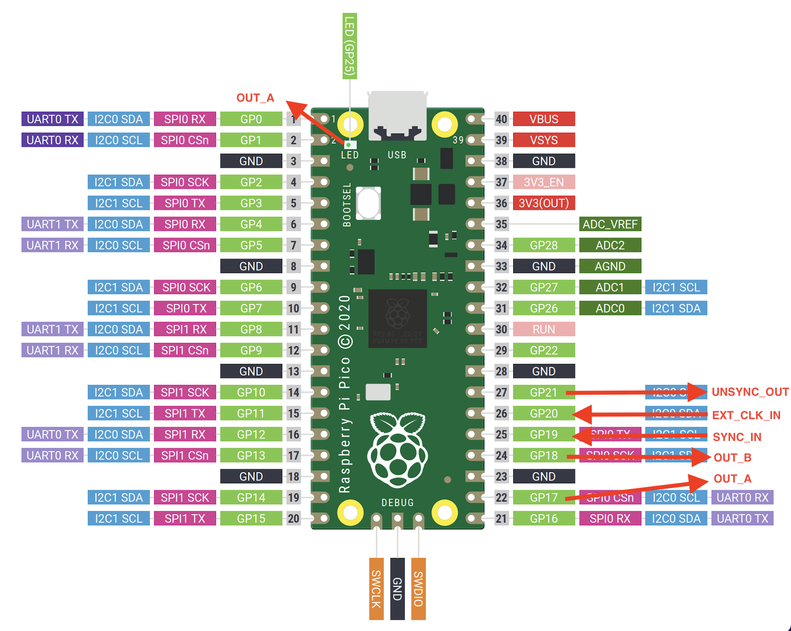

# PicoDIV
Raspberry Pi Pico frequency divider

Divides the input frequency by factor 10^7, 10MHz to 1Hz using PIO.
System clock has to be driven from 10MHz external clock through GPIO.
Based on the [pio_blink example](https://github.com/raspberrypi/pico-examples/tree/master/pio/pio_blink).

Connect 10 MHz 0-3.3V input signal to GPIO20 (pin 26). Output signals will be following:

- GPIO0 (pin 1) - 1 PPS, 10 ms long pulses, 
- GPIO25 (onboard LED) - 1 PPS,
- GPIO21 - 1 MHz 0-3.3V square wave,
- GPIO15 - 100 kHz 0-3.3V square wave.



## PicoDIV_PWM
This is an example to use the internal PWM module to count pulses and generate output divided frequency. However the output pins are also driven by clk_sys. So using the defualt 125 MHz internal clock frequency leads to 8ns jitter on the output pulses.

### Pico programming
Connect the Pico while holding down the button on the Pico board to USB.
Drag and drop the *.uf2 file to Pico board.

In case of problems consult the great Raspberry Pi Pico [Getting Started Guide](https://www.raspberrypi.org/documentation/rp2040/getting-started/#getting-started-with-c).

### Compilation
#### MacOS
Get you environment ready by [installing the toolchain](https://datasheets.raspberrypi.org/pico/getting-started-with-pico.pdf).

Setup local environment variables
```
export PATH="$PATH:/Applications/microchip/xc8/v2.31/bin"
export PICO_TOOLCHAIN_PATH=/Applications/ARM/bin
export PICO_SDK_PATH=<pico-sdk>
```

Change to build directory
```
cd ./build
```

Run commands to compile and build
```
cmake ../
make
```

After that you should find `picoDIV.uf2` file in the build directory that can be used to program your board.
